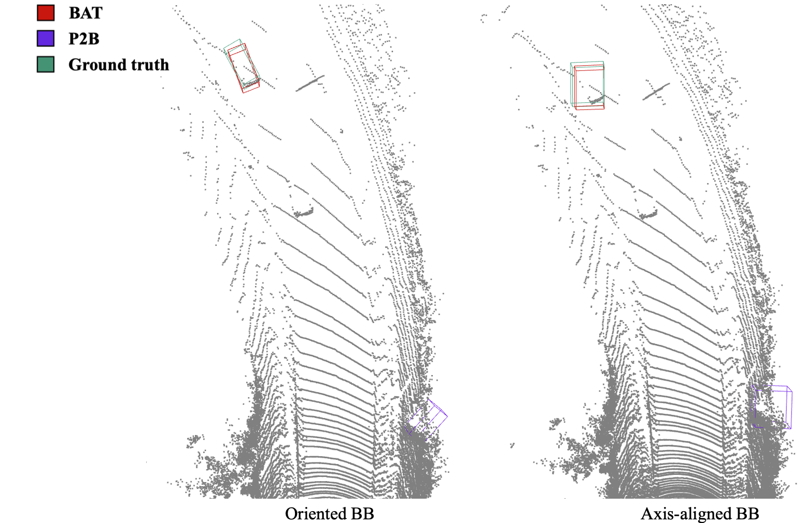

## Introduction
This is the repo showing correct qualitative results of BAT. We provide data and codes to reproduce the visualization results, including the buggy and correct ones.

### Setup
1. Clone this repo:
    ```bash
    git clone https://github.com/BATanonymous/BAT_video.git
    ```
2. Extract the .7z files in [./results](./results). We provide results from Sequence 05,107,19,29 and 97, which were used in our previous comparison video.
3. Install dependencies
    ```
    pip install numpy open3d==0.10.0
    ```
    We saved the boxes as polygonal (rectangle) meshes. Make sure you install the right version of open3d since higher versions don't support loading non-triangle meshes. 


### Usage of the visualization code
First load and show a sequence. Use `--root_dir` to specify the location of the saved results. Use `--tracklet_num` to specify the sequence id (can be 05,107,19,29 and 97). Example:
```bash a
python vis.py --root_dir vis_results --tracklet_num 107
```
Then you can use mouse or keyboard to control the visualization windows. e.g. Press **K** to show the next frame, press **J** to show the previous frame. Use **+** or **-** to change the size of points.
```
-- Mouse view control --
  Left button + drag         : Rotate.
  Ctrl + left button + drag  : Translate.
  Wheel button + drag        : Translate.
  Shift + left button + drag : Roll.
  Wheel                      : Zoom in/out.

-- Keyboard view control --
  J/K          : Show previous/next frame.
  +/-          : increase/decrease the size of points
  [/]          : Increase/decrease field of view.
  R            : Reset view point.

```
If everything goes well, you can get the following view when going through the sequence:


### Reproduce the buggy visualization results
In [vis.py](./vis.py#L59), comment the following code:
```python
#bb = o3d.io.read_triangle_mesh(obj).get_oriented_bounding_box()
#line_set = o3d.geometry.LineSet.create_from_oriented_bounding_box(bb)
```
And then uncomment the following code:
```python
# uncomment the following two lines to reproduce the buggy results.
bb = o3d.io.read_triangle_mesh(obj).get_axis_aligned_bounding_box()
line_set = o3d.geometry.LineSet.create_from_axis_aligned_bounding_box(bb)
```
Finally, re-run the code:
```bash
python vis.py --root_dir vis_results --tracklet_num 107
```
If everything goes well, you can reproduce the following buggy result when going through the sequence:


### Comparison between the correct and buggy results

Here is a closer comparison between the visualizations of oriented bboxes (correct) and axis-aligned bboxes (wrong) using the same saved files. 



Here is the full video of our correct visualization results.


Here is the full video of the previous buggy visualization results.


